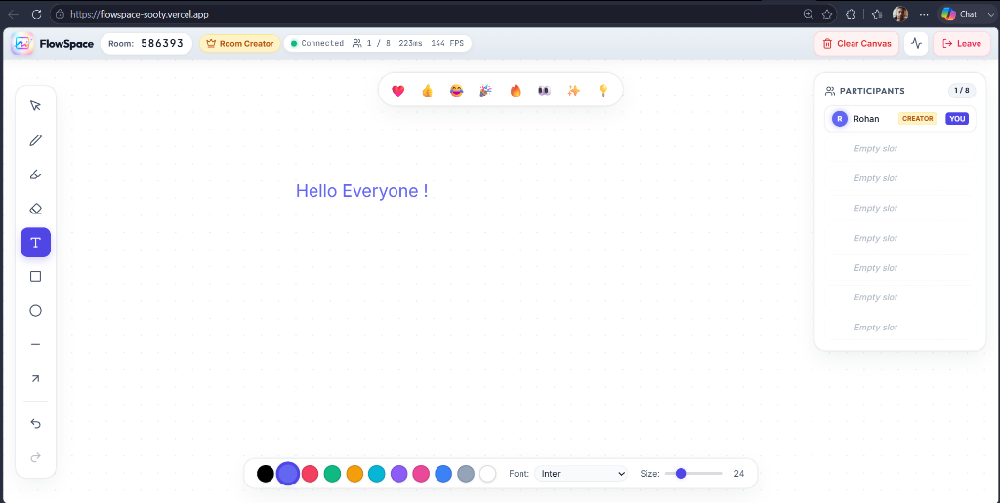
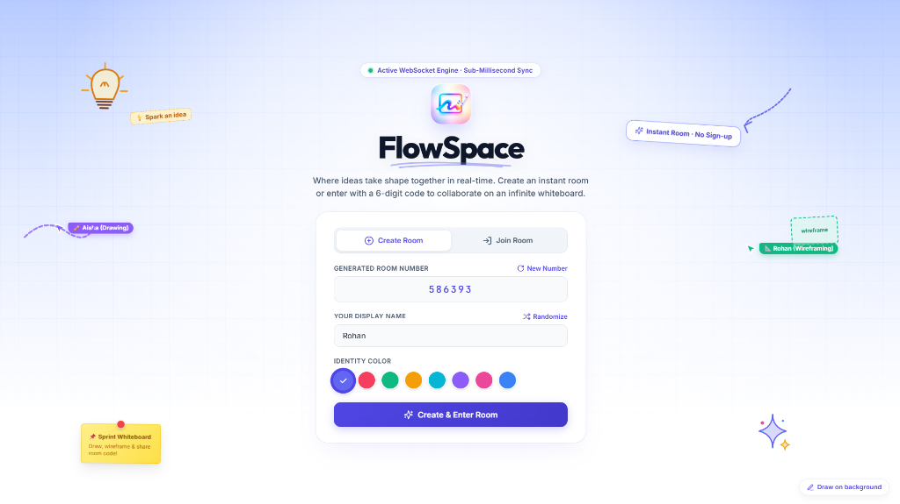

# FlowSpace — Real-Time Collaborative Infinite Canvas

[](https://flowspace-sooty.vercel.app/)
[](https://www.typescriptlang.org/)
[](https://react.dev/)
[](https://nodejs.org/)
[](https://developer.mozilla.org/en-US/docs/Web/API/WebSocket)
[](https://opensource.org/licenses/MIT)

**FlowSpace** is a high-performance, real-time multiplayer infinite canvas built from first principles using **raw WebSockets**, **Node.js**, **React 19**, and **TypeScript** — engineered without third-party synchronization frameworks to guarantee deterministic ordering, bounded linear cursor interpolation, local independent cameras, and sub-millisecond multi-user state sync.

🔗 **Live Production URL**: [https://flowspace-sooty.vercel.app/](https://flowspace-sooty.vercel.app/)

---

## 📸 Visual Walkthrough & Demo

### 1. Collaborative Infinite Whiteboard & Multi-User Canvas


### 2. Interactive Landing & Room Entry


---

## 1. Project Overview

FlowSpace solves the challenge of high-concurrency real-time visual collaboration on an **infinite 2D plane** without relying on heavy abstractions like Yjs, Socket.IO, Automerge, or Firebase. It implements a **custom binary-over-JSON WebSocket protocol** and an **isolated local camera model** providing:
- **Infinite Canvas & World Coordinates**: All strokes, shapes, and text are stored in absolute world pixels — independent of screen size, device orientation, or DPR.
- **Local Independent Cameras**: Every user pans and zooms independently; camera movement generates **zero** WebSocket traffic.
- **Bounded Linear Cursor Interpolation (LERP)**: 60 FPS cursor tracking with 25–30Hz throttled sampling and GPU-accelerated direct DOM transforms.
- **Non-Destructive Owner-Based Object Erasure**: Guests can only delete their own drawings; the Room Creator holds Master Erase authority.
- **Resilient Lifecycle & 60-Second Empty Room Cooldown**: Empty rooms remain cached for 60 seconds before cleanup; 30-second tokenized reconnection grace period protects against network drops.
- **Render Memory Bounds & Flood Protection**: Hard room capacity cap (`MAX_ACTIVE_ROOMS = 500`) comfortably operating within Render's 512 MB RAM ceiling.

---

## 2. Key Features

- **🌐 Infinite Canvas & Local Camera Engine**:
  - Virtual 2D world space with continuous mathematical coordinate transformations.
  - Independent client camera `{ x, y, zoom }` (10% to 500% zoom range).
  - Multi-input navigation: mouse wheel cursor-focused zoom, spacebar/middle-click pan, mobile 2-finger pan & pinch-zoom, and glassmorphic `[ − ] 100% [ + ]` zoom dock.
- **⚡ Raw WebSocket Transport**: 100% custom protocol using native `WebSocket` (browser) and `ws` (Node.js) with runtime Zod validation.
- **🎯 Smooth Remote Cursor Tracking**: 25–30Hz throttled cursor broadcasting in world coordinates, rendered locally in real-time via `requestAnimationFrame` interpolation.
- **🎨 Comprehensive Vector & Drawing Tools**:
  - Freehand Pen with batch point compression (up to 50 points/frame).
  - Semi-transparent Highlighter with blending.
  - Geometric Vector Shapes (Rectangle, Circle, Line, Arrow) with live interaction previews.
  - Inline Rich Text creation with font family selection and sizing.
- **🛡️ State Ownership & Non-Destructive Erase Policy**:
  - Regular participants can only erase their own creations (`requestingUserId === obj.creatorId`).
  - The **Room Creator** possesses Master Erase authority and can clear or delete any object in the room.
  - Objects created by departed users remain permanently on the canvas.
- **🔄 Session Continuity & 60s Room Cooldown**:
  - Unintentional disconnects enter a 30-second `reconnecting` grace window, preserving participant identity.
  - When all users leave, the room enters a 60-second cooldown window so returning users retain their canvas.
- **👥 Synchronous Room Capacity (Max 8 Users / Max 500 Rooms)**:
  - Atomic room occupancy verification prevents race conditions and emits standard `room_full` rejection events.
- **🎉 Ephemeral Floating Reactions**:
  - Real-time emoji burst broadcasts with physics-based velocity decay and particle fade.
- **📊 Real-Time Diagnostic Telemetry**:
  - Live round-trip time (RTT via EMA smoothing), render FPS counter, socket buffer monitoring, and message rate counters.
- **📱 Fully Responsive Design**:
  - Seamlessly adapts across Desktop, Tablet, Mobile (portrait/landscape), and Split-Screen window layouts with touch-friendly controls.

---

## 3. Tech Stack & Architectural Roles

| Technology | Purpose & Architectural Role |
| :--- | :--- |
| **TypeScript 5.7** | End-to-end type safety across client, server, and shared protocol packages. |
| **React 19** | Component UI state, active toolbar controls, and telemetry modals. |
| **HTML5 Canvas 2D** | High-performance DPR-aware infinite vector rendering, stroke paths, and shapes. |
| **Node.js (v20+)** | Asynchronous event-driven server runtime handling concurrent socket connections. |
| **`ws` (Raw WebSockets)** | Minimalist, low-overhead WebSocket server implementation. |
| **Zod** | Runtime schema verification and boundary protection for all incoming packets. |
| **Vite 6** | Ultra-fast client bundling, hot-module replacement, and tree-shaking. |
| **Vitest** | Automated unit tests and end-to-end multi-client WebSocket test suites. |

---

## 4. Coordinate Transformation & Camera Model

FlowSpace separates **World Coordinates** (stored in shared state) from **Screen Coordinates** (local viewport pixels):

$$\text{Screen to World (Input):} \quad \text{worldX} = \frac{\text{screenX} - \text{camera.x}}{\text{camera.zoom}}, \quad \text{worldY} = \frac{\text{screenY} - \text{camera.y}}{\text{camera.zoom}}$$

$$\text{World to Screen (Render):} \quad \text{screenX} = \text{worldX} \cdot \text{camera.zoom} + \text{camera.x}, \quad \text{screenY} = \text{worldY} \cdot \text{camera.zoom} + \text{camera.y}$$

```mermaid
graph TD
    subgraph Client A (Desktop - 100% Zoom)
        CamA[Camera: 0, 0 @ 1.0x] --> TransA[Screen <-> World]
        TransA --> RenderA[2D Canvas Viewport]
    end

    subgraph Client B (Phone - 150% Zoom)
        CamB[Camera: 200, 100 @ 1.5x] --> TransB[Screen <-> World]
        TransB --> RenderB[2D Canvas Viewport]
    end

    subgraph Server (Authoritative World Space)
        RoomState[(Persistent World Objects\nStrokes, Shapes, Text)]
    end

    RenderA <-->|World Coordinates Only| RoomState
    RenderB <-->|World Coordinates Only| RoomState
```

---

## 5. Project Structure

```
FlowSpace/
├── package.json                    # Monorepo scripts & dependencies
├── tsconfig.json                   # Root TypeScript configuration
├── ARCHITECTURE.md                 # Deep-dive protocol & architectural specs
├── README.md                       # Main project documentation
├── docs/
│   └── images/                     # Production UI screenshots
├── server/                         # Backend WebSocket Server
│   ├── package.json
│   ├── tsconfig.json
│   ├── src/
│   │   ├── index.ts                # HTTP + WebSocket server bootstrap
│   │   ├── config.ts               # Server limits (500 rooms, 60s cooldown, 30s reconnect)
│   │   ├── dispatcher.ts           # Protocol router & Zod validation
│   │   ├── room.ts                 # RoomManager & Room lifecycle state
│   │   ├── session.ts              # Session lifecycle & resume tokens
│   │   ├── rateLimiter.ts          # Token-bucket rate limiters
│   │   ├── handlers/               # Modular action handlers (canvas, cursor, join, etc.)
│   │   └── shared/                 # Internalized schemas & types
│   └── test/
│       ├── protocol.test.ts        # Schema validation, cooldown & erase authorization tests
│       └── e2e.test.ts             # Multi-client socket sync & disconnect tests
└── client/                         # Frontend React Application
    ├── package.json
    ├── vite.config.ts
    ├── index.html
    └── src/
        ├── App.tsx                 # Main application controller
        ├── index.css               # Design system & responsive layout styles
        ├── canvas/                 # CanvasRenderer, coordinates.ts & LocalUndoManager
        ├── realtime/               # wsClient, cursorEngine, interpolator, telemetry
        ├── components/             # Header, CanvasView, Toolbar, PresenceSidebar, JoinScreen
        └── shared/                 # Internalized schemas & types
```

---

## 6. Installation & Local Setup

### Prerequisites
- **Node.js**: v18.0.0 or higher
- **npm**: v9.0.0 or higher

### 1. Clone the Repository
```bash
git clone https://github.com/pranjal-v7/FlowSpace.git
cd FlowSpace
```

### 2. Install Dependencies
```bash
npm install
npm --prefix server install
npm --prefix client install
```

### 3. Run Locally in Development Mode
```bash
npm run dev
```
- **Frontend Client**: `http://localhost:5173` (or `http://localhost:3000`)
- **Backend WebSocket Server**: `http://localhost:4000` (`ws://localhost:4000`)

### 4. Build for Production
```bash
npm run build
```

---

## 7. Environment Variables

| Variable | Scope | Default | Description |
| :--- | :--- | :--- | :--- |
| `PORT` | Server | `4000` | Port for HTTP & WebSocket server. |
| `MAX_ACTIVE_ROOMS` | Server | `500` | Active room limit tailored for 512MB RAM cloud environments (Render). |
| `NODE_ENV` | Server | `development` | Node environment (`production` / `development`). |
| `VITE_WS_URL` | Client | `ws://localhost:4000` | Public WebSocket endpoint (`wss://...`). |

---

## 8. Automated Testing Suite

FlowSpace includes comprehensive Vitest test suites covering protocol validation, 60s empty-room cooldowns, capacity boundaries, ownership authorization, and multi-client WebSocket lifecycles.

To run all automated tests:
```bash
npm --prefix server test
```

### Test Coverage Summary (10/10 Passing):
- **Protocol Schema Tests**:
  - `join_room` message validation and malformed payload rejection.
  - Finite world coordinate bounds validation.
  - Stroke point batch sizing and text length limits.
  - Owner-only erase authorization vs Room Creator master erase.
  - 60-second empty room cooldown verification.
- **E2E Multi-Client WebSocket Tests**:
  - Client join and authoritative `room_snapshot` delivery.
  - Concurrent multi-client stroke and shape synchronization.
  - Graceful disconnect (`presence_leave`) and session resumption (`presence_join`).
  - Strict 8-user room capacity limit rejection (`room_full`).

---

## 9. License

This project is licensed under the [MIT License](LICENSE).
