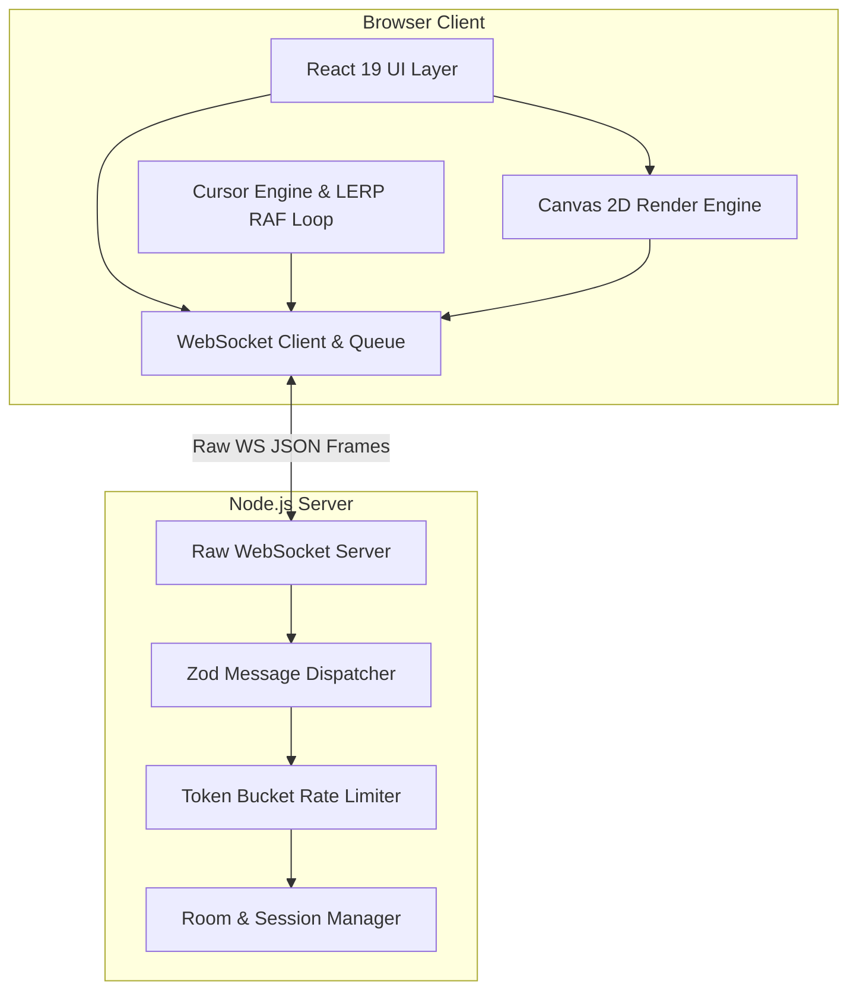

# FlowSpace — Real-Time Collaborative Canvas

[](https://flowspace-sooty.vercel.app/)
[](https://www.typescriptlang.org/)
[](https://react.dev/)
[](https://nodejs.org/)
[](https://developer.mozilla.org/en-US/docs/Web/API/WebSocket)
[](https://opensource.org/licenses/MIT)

**FlowSpace** is a high-performance, lightweight real-time multiplayer canvas built from first principles using **raw WebSockets**, **Node.js**, **React 19**, and **TypeScript** — engineered without third-party synchronization frameworks to guarantee deterministic ordering, bounded linear cursor interpolation, and sub-millisecond multi-user state sync.

🔗 **Live Production URL**: [https://flowspace-sooty.vercel.app/](https://flowspace-sooty.vercel.app/)

---

## 📸 Visual Walkthrough & Demo

### 1. Collaborative Whiteboard & Multi-User Canvas


### 2. Interactive Landing & Room Entry


---

## 1. Project Overview

FlowSpace solves the challenge of high-concurrency real-time visual collaboration on the web without relying on heavy abstractions like Yjs, Socket.IO, Automerge, or Firebase. It implements a **custom binary-over-JSON WebSocket protocol** that provides:
- Bounded linear cursor interpolation at 60 FPS.
- Batched point streaming with low latency.
- Non-destructive owner-based object erasure.
- Seamless 30-second tokenized session reconnects during network drops.

---

## 2. Key Features

- **⚡ Raw WebSocket Transport**: 100% custom protocol using native `WebSocket` (browser) and `ws` (Node.js) with Zod runtime validation on every inbound message frame.
- **🎯 Smooth Remote Cursor Tracking**: 25–30Hz throttled cursor sampling with client-side linear interpolation (LERP) in a dedicated `requestAnimationFrame` render loop, bypassing React state to achieve a smooth 60 FPS.
- **🎨 Comprehensive Vector & Drawing Tools**:
  - Freehand Pen with batch point compression (up to 50 points/frame).
  - Semi-transparent Highlighter with blending.
  - Geometric Vector Shapes (Rectangle, Circle, Line, Arrow) with live interaction previews.
  - Inline Rich Text creation with font family selection and sizing.
- **🛡️ State Ownership & Non-Destructive Erase Policy**:
  - Regular participants can only erase their own creations (`requestingUserId === obj.creatorId`).
  - The **Room Creator** possesses Master Erase authority and can clear or delete any object in the room.
  - Objects created by departed users remain permanently on the canvas.
- **🔄 Session Continuity & Grace Period**:
  - Unintentional disconnects enter a 30-second `reconnecting` grace window, preserving participant color, slot, and identity token.
  - Explicit leaves instantly clear session credentials and allow rejoin with a fresh identity.
- **👥 Synchronous Room Capacity (Max 8 Users)**:
  - Atomic room occupancy verification prevents race conditions and emits standard `room_full` rejection events.
- **🎉 Ephemeral Floating Reactions**:
  - Real-time emoji burst broadcasts with natural physics-based velocity decay and particle fade.
- **📊 Real-Time Diagnostic Telemetry**:
  - Live round-trip time (RTT via EMA smoothing), render FPS counter, socket buffer monitoring, and message rate counters.
- **📱 Fully Responsive Design**:
  - Seamlessly adapts across Desktop, Tablet, Mobile (portrait/landscape), and Split-Screen window layouts.

---

## 3. Tech Stack & Architectural Roles

| Technology | Purpose & Architectural Role |
| :--- | :--- |
| **TypeScript 5.7** | End-to-end type safety across client, server, and shared protocol packages. |
| **React 19** | Component UI state, active toolbar controls, and telemetry modals. |
| **HTML5 Canvas 2D** | High-performance DPR-aware vector rendering, stroke paths, and shapes. |
| **Node.js (v20+)** | Asynchronous event-driven server runtime handling concurrent socket connections. |
| **`ws` (Raw WebSockets)** | Minimalist, low-overhead WebSocket server implementation. |
| **Zod** | Runtime schema verification and boundary protection for all incoming packets. |
| **Vite 6** | Ultra-fast client bundling, hot-module replacement, and tree-shaking. |
| **Vitest** | Automated unit tests and end-to-end multi-client WebSocket test suites. |

---

## 4. System Architecture & Data Flow

FlowSpace enforces strict modular decoupling between five core layers:



1. **Transport Layer (`wsClient.ts`)**: Manages the native WebSocket lifecycle, exponential backoff, sequence tracking, and `bufferedAmount` monitoring.
2. **Protocol & Validation Layer (`dispatcher.ts`, `schemas.ts`)**: Inbound messages pass through strict Zod parsers before mutating room state.
3. **Cursor Engine & Interpolator (`cursorEngine.ts`, `interpolator.ts`)**: Throttles pointer events to 30Hz and runs an isolated RAF loop applying GPU-accelerated `translate3d` transforms directly to DOM elements.
4. **Canvas Engine (`canvasRenderer.ts`, `undoManager.ts`)**: Manages retina DPR scaling, path interpolation, drawing state, and local 20-action undo stacks.
5. **Session & Room Management (`room.ts`, `session.ts`)**: Handles monotonic sequencing, capacity limits, token grace periods, and broadcasts.

---

## 5. Project Structure

```
FlowSpace/
├── package.json                    # Monorepo scripts & dependencies
├── tsconfig.json                   # Root TypeScript configuration
├── ARCHITECTURE.md                 # Deep-dive protocol & architectural specs
├── README.md                       # Main project documentation
├── docs/
│   └── images/                     # Production UI screenshots
├── server/                         # Backend WebSocket Server
│   ├── package.json
│   ├── tsconfig.json
│   ├── src/
│   │   ├── index.ts                # HTTP + WebSocket server bootstrap
│   │   ├── config.ts               # Server limits & heartbeat intervals
│   │   ├── dispatcher.ts           # Protocol router & Zod validation
│   │   ├── room.ts                 # RoomManager & Room state
│   │   ├── session.ts              # Session lifecycle & resume tokens
│   │   ├── rateLimiter.ts          # Token-bucket rate limiters
│   │   ├── handlers/               # Modular action handlers (canvas, cursor, join, etc.)
│   │   └── shared/                 # Internalized schemas & types
│   └── test/
│       ├── protocol.test.ts        # Schema validation & erase authorization tests
│       └── e2e.test.ts             # Multi-client socket sync & disconnect tests
└── client/                         # Frontend React Application
    ├── package.json
    ├── vite.config.ts
    ├── index.html
    └── src/
        ├── App.tsx                 # Main application controller
        ├── index.css               # Design system & responsive layout styles
        ├── canvas/                 # CanvasRenderer & LocalUndoManager
        ├── realtime/               # wsClient, cursorEngine, interpolator, telemetry
        ├── components/             # Header, CanvasView, Toolbar, PresenceSidebar, JoinScreen
        └── shared/                 # Internalized schemas & types
```

---

## 6. Installation & Local Setup

### Prerequisites
- **Node.js**: v18.0.0 or higher
- **npm**: v9.0.0 or higher

### 1. Clone the Repository
```bash
git clone https://github.com/pranjal-v7/FlowSpace.git
cd FlowSpace
```

### 2. Install Dependencies
```bash
npm install
npm --prefix server install
npm --prefix client install
```

### 3. Run Locally in Development Mode
```bash
npm run dev
```
- **Frontend Client**: `http://localhost:3000`
- **Backend WebSocket Server**: `http://localhost:4000` (`ws://localhost:4000`)

### 4. Build for Production
```bash
npm run build
```

---

## 7. Environment Variables

| Variable | Scope | Default | Description |
| :--- | :--- | :--- | :--- |
| `PORT` | Server | `4000` | Port for the HTTP and WebSocket server. |
| `NODE_ENV` | Server | `development` | Node environment (`production` / `development`). |
| `VITE_WS_URL` | Client | `ws://localhost:4000` | Public WebSocket endpoint (e.g. `wss://flowspace-server.onrender.com`). |

---

## 8. Usage Guide

1. **Create or Enter a Room**:
   - Open the application and choose **Create Room** (generates a 6-digit room number) or enter an existing code in **Join Room**.
   - Pick your display name and identity color swatch.
2. **Collaborative Drawing**:
   - Select the **Pen**, **Highlighter**, or **Shape Tools** (Rectangle, Circle, Line, Arrow) to draw on the canvas.
   - Click the **Text Tool** to place rich text anywhere on the canvas.
3. **Cursor & Telemetry Awareness**:
   - Move your mouse to broadcast live cursor positions to other connected room members.
   - Click the **Activity Waveform (📈)** in the header to view live ping (RTT), frame rate (FPS), and buffer status.
4. **Reactions**:
   - Click any emoji in the top floating reaction dock to broadcast animated emoji bursts.
5. **Leaving vs Disconnecting**:
   - Click **Leave** in the top right to explicitly exit the room.

---

## 9. WebSocket Protocol Specification

All frames are strictly typed JSON packets:

### Client $\rightarrow$ Server Messages

```typescript
// Join Room
{ type: "join", roomId: string, displayName: string, preferredColor?: string, resumeToken?: string, isCreating?: boolean }

// Move Cursor (30Hz normalized [0, 1])
{ type: "cursor", seq: number, x: number, y: number, timestamp: number }

// Draw Stroke
{ type: "stroke", strokeId: string, color: string, size: number, opacity: number, isHighlighter?: boolean, points: [number, number][] }

// Create Vector Shape
{ type: "shape_create", shapeId: string, shapeType: "rectangle"|"circle"|"line"|"arrow", color: string, size: number, opacity: number, startX: number, startY: number, endX: number, endY: number, fill?: boolean }

// Add Text
{ type: "text_create", textId: string, x: number, y: number, content: string, color: string, font: string, fontSize: number }

// Erase Object (Owner-only or Room Creator)
{ type: "erase", objectId: string }

// Ephemeral Reaction Burst
{ type: "reaction", id: string, emoji: string, x: number, y: number }

// Explicit Leave
{ type: "leave" }

// Heartbeat & RTT Ping
{ type: "app_ping", timestamp: number }
```

### Server $\rightarrow$ Client Messages

```typescript
// Welcome / Identity Handshake
{ type: "welcome", userId: string, resumeToken: string, sessionVersion: number, color: string, displayName: string, roomId: string, isHost: boolean }

// Full Room State Snapshot
{ type: "room_snapshot", roomId: string, capacity: number, users: Participant[], cursors: RemoteCursorSnapshot[], objects: CanvasObject[] }

// Presence Broadcasts
{ type: "presence_join", user: Participant }
{ type: "presence_leave", userId: string }

// Remote Cursor Update
{ type: "cursor", userId: string, seq: number, x: number, y: number, timestamp: number }

// Object Synchronizations
{ type: "stroke", creatorId: string, strokeId: string, color: string, size: number, opacity: number, isHighlighter?: boolean, points: [number, number][] }
{ type: "shape_create", object: CanvasShapeObject }
{ type: "text_create", object: CanvasTextObject }
{ type: "erase", objectId: string, eraserId: string }
{ type: "clear_canvas", clearedBy: string }

// Capacity / Error
{ type: "room_full", roomId: string, capacity: number }
{ type: "error", code: string, message: string }
{ type: "app_pong", clientTimestamp: number, serverTimestamp: number }
```

---

## 10. Engineering Decisions & Tradeoffs

### 1. Latency vs. Smoothness Tradeoff
- **Decision**: Outgoing cursor coordinates are sampled at ~30Hz and transmitted with normalized `[0, 1]` floats. The client maintains a 2-sample buffer and uses linear interpolation (LERP) in `requestAnimationFrame` with a 30–50ms interpolation delay.
- **Tradeoff**: Introducing a ~40ms interpolation delay eliminates jitter and rubber-banding over fluctuating network connections at the cost of imperceptible visual latency.

### 2. State Ownership & Non-Destructive Erasing
- **Decision**: Server enforces strict object creator verification for deletions. Guest participants cannot delete strokes created by peers. The **Room Creator** possesses master erase permissions.
- **Tradeoff**: Avoids destructive edit conflicts and griefing while keeping server memory state lightweight without needing complex operational transformation (OT) algorithms.

### 3. Backpressure & Socket Protection
- **Decision**: The client monitors `socket.bufferedAmount`. If outgoing network congestion exceeds 64KB, ephemeral cursor frames are dropped in favor of critical vector stroke commits.
- **Tradeoff**: Prioritizes drawing consistency and room state integrity over high-frequency pointer packets during network throttling.

---

## 11. Automated Testing Suite

FlowSpace includes comprehensive test suites covering protocol validation, capacity boundaries, ownership authorization, and multi-client WebSocket lifecycles.

To run all automated tests:
```bash
npm --prefix server test
```

### Test Coverage Summary (9/9 Passing):
- **Protocol Schema Tests**:
  - `join_room` message validation and malformed payload rejection.
  - Cursor coordinate bounds validation `[0, 1]`.
  - Stroke point batch sizing and text length limits.
  - Owner-only erase authorization vs Room Creator master erase.
- **E2E Multi-Client WebSocket Tests**:
  - Client join and authoritative `room_snapshot` delivery.
  - Concurrent multi-client stroke and shape synchronization.
  - Graceful disconnect (`presence_leave`) and session resumption (`presence_join`).
  - Strict 8-user room capacity limit rejection (`room_full`).

---

## 12. Limitations & Future Roadmap

- **Layer Ordering (Z-Index)**: Objects currently render in creation order. Future enhancements can introduce explicit layer reordering (bring forward / send backward).
- **Persistent Storage**: Canvas states are currently maintained in server memory (retained during session grace periods). Adding PostgreSQL / SQLite with WAL mode will enable persistent room archiving.
- **Image Uploads & Export**: Adding client-side image importing and canvas PNG/SVG export.

---

## 13. Project Metrics & Disclosures

- **Total Development Time**: ~18 Hours (Architecture design, WebSocket engine, responsive UI, interpolation tuning, and pre-submission audit).
- **AI Tool Usage**: Built in pair-programming collaboration with Google DeepMind's Antigravity assistant for testing, responsive layout refinement, and edge-case validation.

---

## 14. License

This project is licensed under the [MIT License](LICENSE).
